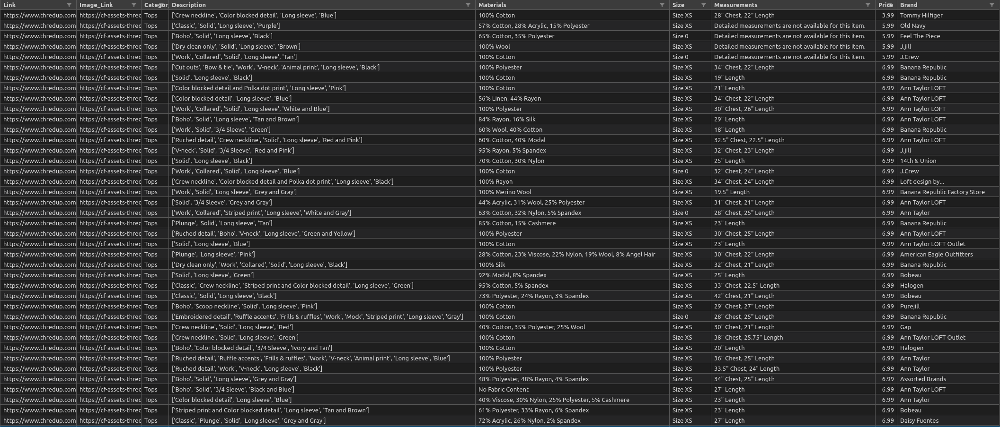

# Thredup Database
*A webscraper to extract individual product links from a search page (50 per page) and then parse each product link to pull the following information:*

Information to be extracted | Function | Example
|---------------------------|----------|--------|
Link | url of each item on a page | [Item_Link](https://www.thredup.com/product/women-cotton-tommy-hilfiger-blue-pullover-sweater/58862377?sizing_id=750,755,756,765,791,799,774)
Category Type | clothing type | Tops
Image_Link | front picture of item | [Picture_Link](https://cf-assets-thredup.thredup.com/assets/174145145/retina.jpg)
Description | distinct features | 'Crew neckline', 'Color blocked detail', 'Long sleeve', 'Blue'
Materials | fabric content and it's percentage | 100% Cotton
Size | item size | Size XS  
Measurement | measurements depend on item itself | 28" Chest, 22" Length
Price | price | 3.99
Brand | name brand | Tommy Hilfiger

An example of what the database looks like (so far):

# Purpose
> Most clothing is environmentally damaging to the environment, even AFTER it's been bought. For example, washing polyester or any plastic-made clothing in the washing machine releases micro-plastics in the ocean. In addition, wearing non-natural fibers is less comfortable, less breathable, and falls apart quicker than stronger fabrics made of linen, wool, silk, etc. Of course, we are speaking in general terms. Microplastics and environmental damage also depend on the company, manufacturer, process of using materials (Ex: recycled polyester), quality, etc. 
**Used clothing > new clothing**
> - Less environmental damage
> - less waste ($billions of usable clothing is thrown away each year)
> - less shipping involved. New items are shipped from location to location to create the final product wheras a used item is shipped once to a new owner
> - more available styles since vintage pieces are hard to buy new
> - many more benefits that you can read ______________________________

Objective: 
- filter out clothing by fabrics (polyester, polyamide, etc.)
	- second layer of filter for rayon, nylon, etc.
- sort out clothing specifically by fabrics (wool, linen, etc.)

### Addresses issues with Thredup's website
- limited filters within the "petite" category such as
	- not able to search by fabrics
		-Ex:  linen/cotton combination
		- Ex: 100% wool
	- not able to filter out fabrics
		- Ex: no polyester
		- Ex: no polyester **or** acrylic

# Installation
*Due to testing the scraping component, some of the inputs are hardcoded for now. Here are instructions for scraping items for yourself:

1. Fork this directory and then go into the /thredup-scraper-api/code/database_basic_scrape.py file to change the following variables. This is the main .py file where everything runs.
2. Open up thredup.com and search for a category type (Ex: sweaters) and filter out by size and any of the other features you are specifically looking for
3. Line 32: Copy the url link and replace variable `url_original`
4. Line 51: range represents page numbers. Leave as 1 but change the second number to how ever many pages you want to scrape. If there are only 5 pages, then put down (1,6) since it needs to include the 5th page.
5. Line 187: change the location and name of the csv file to be exported. The default location is set to `thredup-scraper-api/datasets/test_runs`
6. Run the code or run through the terminal:

- Linux/Mac: `python ~/thredup-scraper-api/code/database_basic_scrape.py`

- Windows:

### Things to know:
- This project doesn't use rotating proxies and HTTP headers due to time/money. Therefore, the code has a 5-10 second timer delay to each request being pulled.
- Scraping one page i.e. 50 items per page, will take 6 to 8 minutes. 

 
## Programs
*This project contains other libraries/python programs separate from the database project within the '/code/additional_modules' directory. They are:

**thredup_tabs.py**
*Scrapes a given number of items withing a search page to gilters out clothing by the following "Materials":*
- Polyester
- Acrylic
- Fabric details not available
- No Fabric Content

>**How to use it**
>- input: url of current page
>- output: new chrome tabs open one by one only showing fabrics that don't contain any of the banned words. 3 second delay per tab

## Requirements

### Easiest
"_______________" conda environment is uploaded to be able to use it right out of the box. Download this first then 
`git clone https://github.com/tas09009/thredup-scraper-api.git`

### Second Easiest
- Python 3.0 or greater

#### Modules
- requests
- re
- time
- random
- beautifulsoup
- pandas
- numpy
- alive_progress

---

# Kanban
## To do

### Improve Code

### Inputs from user
- [ ] sys.argv:
	- [ ] url
	- [ ] # of pages
		- [ ] All pages: program needs to know how many pages the search has + 1 (to be able to scrape until the last page)
	- [ ] file name and location

### Features
- [ ] bug tracker
- [ ] logger
- [ ] speed up program and compare log files
- [ ] View/preview images
- [ ] requirements.txt file + conda environment
- [ ] python library to be used outside of this environment
- [ ] blog post write-up

### Efficiency
- [ ] functionize everything in database_basic_scrape
- [ ] parse a smaller section of a product's page (`ui-container u-flex _36TeFiFjuh5xlahzk4iZeQ`) which contains all elements that I'm looking for (double check): measurements, size, materials, etc.
	- [ ] only issue is not being able to scrape category_type (not included above)
	- [ ] 6125 lines of code - parsing entire product_page over and over
	- [ ] 107 lines of code - parsing just the element above
- [ ] simplify CSS tags (remove double tags)
- [ ] use scrappy instead of bs4. Scrappy is better designed for multi-page parsing

### Automate
- [ ] append all items for all pages to a *single* csv file
	- [ ] If not: merge csv files within category_type 
- [ ] verify category_type for each csv
- [ ] merge all csv files together -> ready for data analysis!
	
- [ ] create a new conda environment to upload

### Data Science/Machine Learning
- [ ] Extract additional features from the "Description" column
	- [ ] color, sleeve length, neckline, etc.
- [ ] ml model to recommend calling based on style: boho, classic, etc.

## In Progress
### Autumn Wardrobe
- [x] at least 300 items per category
	- [x] sweaters
	- [x] jacket
	- [x] long-sleeve shirt
	- [x] long-sleeve dress. Can be wool
	- [x] pants
- [ ] merge all tables together
	- [ ] category_type of sweaters is tops. Manual change

- [ ] create a kanban board on github

### Readme.md + github
- [ ] Organize README.md
- [x] Clean up all code (as much as possible)
- [x] files -> directories

## Done
### Webscrape 1st edition
- [x] basic database scrape - FINALLY DONE

### Random
- [x] csv file
- [x] remove all urls except for the main one
- [x] Change name to 'Thredup API'
- [x] convert price to numbers. Right now it's a string
- [x] slow down scraping. Randomize requests between 10 - 20 seconds
- [x] print progress bar

### Naming convention
- [x] redo all variable names
	- [x] remove scrape at the end
- [x] remove variables with same name:
	- [x] Ex: product_item. Doesn't affect code. Just not good code I suppose

### Readme.md + github
- [x] send both to Github. Notes as README.md page
- [x] Approve "little_feature" + "basic_scrape" mergers, in that order

### Product hrefs
*scrape all items from search result*
- [x] pull href links for 1 search-result page
	- [x] combine with href header list: thredup.com
	- [x] for loop for multiple url pages

### Category labels
- [x] Main clothing categories: dresses, tops, etc.
	- [x] Dictionary for categories within categories. Ex: dresses will have "Maxi" and "Midi" types where as tops will have "blouses" and "tunics"
		- [x] need a url for each category - regex urls 
			- [x] list of categories, for loop to use cateogry within a url

### Avoid Blocks
- ~~learn how to use try/except for proxies_list. Except: use own IP address~~ *not worth the effort. Based on looking through the robots.txt file and realizing the need to buy premium proxies, will scrape as normal*

### large_webscrape
*Description items to be divided *
- [x] category_scrape: list of clothing category titles (features)
	- [x] category_urls: url for each item in category_scrape
	- [x] product_filter_1sthalf: Product category type, first half of page
	- [x] pattern_accents_2ndhalf: Product category type, 2nd half of page	

---

### Tested and Failed
importing functions:  caused circular dependencies

- realized I cannot use Beautiful Soup HTML parser for Thredup because I cannot extract all the hrefs from the site for all the items. I have no idea where they are then! 
	- XML will be the way to go, all items are in a grid with the 2nd to last number increasing for each item.
- ~~add item per row, rather than at the end of the list~~ *would require too much memory and time to write each row rather than 50 rows at a time*

---

---
# Notes
*what percentage can be used for the following, after filtration indifferent to style. What about post style?*
Can I use ML to classify sweaters as actual sweaters?
- basically sort by fabrics first, then style, then price

### Description for tops:
- Search shorts: rompers are also displayed and identified as dresses
- contents of rayon, nylon and viscose cannot be higher than 50%
separate function that eliminates these materials completely

Style
shoulder cut - doesn't always pertain
pattern

accents
accents
accents
"work" - doesn't belong anywhere
neckline - contains the word neck
sleeve length - contains sleeve
color

## Website inconsistencies
- two tops are exactly the same but have different descriptions. [Here](https://www.thredup.com/product/women-cotton-ann-taylor-loft-pink-short-sleeve-blouse/79780008?sizing_id=750,755,756,765,774,778,791,799) and [here](https://www.thredup.com/product/women-cotton-ann-taylor-loft-red-short-sleeve-blouse/80488225?sizing_id=750,755,756,765,774,778,791,799)
	- this [blue top](https://www.thredup.com/product/women-rayon-ann-taylor-loft-outlet-teal-short-sleeve-blouse/80475452?sizing_id=750,755,756,765,774,778,791,799) and [white top](https://www.thredup.com/product/women-rayon-ann-taylor-loft-outlet-teal-short-sleeve-blouse/80475452?sizing_id=750,755,756,765,774,778,791,799) are similar to the red tops above. Again, different descriptions
- when jumping between different categories, the "sort by" method changes to "Recently Discounted" by default
- Only product filters all clothing items have in common are:
	- color
	- pattern
	- accents
- This project will be helpful to only those who are *petite* but eventually should expand to the others as well
	- Use [baserow](https://baserow.io/) as an online database to host the extension?
- Catch microplastics in wahsing machine (if you have to buy polyester) with: 
	- [coraball](https://coraball.com/)
	- [filtrol](https://filtrol.net/)
	- [Guppyfriend washing bag](https://us.guppyfriend.com/)
- [Express casual pants](https://www.thredup.com/product/women-polyester-express-maroon-casual-pants/78663501?sizing_id=750,755,756,765,774,791,799) - amour vert knockoff
- Thredup's classes, id, div tags all have unintuitive names. Other websites's labels make much more sense
- [thredup.com/robots.txt](https://www.thredup.com/robots.txt)
- Tutorial: [Web Scraping and BeautifulSoup](https://www.dataquest.io/blog/web-scraping-beautifulsoup/) exactly what I'm doing
- [ ] Integrate IP addresses [Web scraping with Python](https://medium.com/web-scraping-a-z) - 3 medium articles
- [ ] [robots.txt](https://www.thredup.com/robots.txt): rules of scraping such as frequency and specific pages
- [ ] Thredup doesn't have an API, not for Python atleast
- [robots.txt](https://www.thredup.com/robots.txt) doesn't seem to mind scraping petite items. No crawl rate mentioned either
- [ ] thredup should have a database of the top 10 brands and their measurements and it should automatically pull from that when a brand is matched

- [ ] where does Viscose fall into place?
- [ ] Some items sold are using 'recycled polyester' such as this [Eileen Fisher Trenchcoat](https://www.thredup.com/product/women-recycled-polyester-eileen-fisher-black-trenchcoat/80239531?sizing_id=750,755,756,765,774,791,799,778)
- [ ] how much of the clothing is fast fashion? obviously only in the petite category
- [ ] Other thredup projects:
	- [ ] [Thredup](https://github.com/sarc007/Thredup) A project to extract data from the website and do statistical calculations on it Below is the description of the requirement
	- [ ] [Thredup-Cart-Refresher](https://github.com/Eritz/Thredup-Cart-Refresher) Refreshes items inside the Thredup account's cart
	- [ ] [WebCrawler-ThredUp](https://github.com/yaisah/WebCrawler-ThredUp) I created this web crawler to scrape data from ThredUp products into a database
	- [ ] build a seasonal wardrobe with 5 items under $100 or $200? Use Vetta for ideas
## Learning
- git
- databases: postgresql + pgadmin
- documentation
- python fundamentals: functions, classes and data structures
- command line

## Fabrics
Sources:
- [4 Fabrics That Are Harming Our Planet + What To Look For Instead](https://www.mindbodygreen.com/0-25104/the-4-most-toxic-fabrics-their-ecofriendly-upgrades.html)
- [The Most Harmful Fabrics in Fashion (and A Personal Challenge](https://www.jessannkirby.com/the-most-harmful-fabrics-in-fashion-and-a-personal-challenge/)
- banned fabric keywords: Polyester, Polyamide, Acrylic, No Fabric Content
- Next level to block: nylon, rayon, viscose
- Good fabrics: organic cotton, wool, silk, hemp, linen, cupro, ramie, tencel (used only)
- Iffy fabircs: 
	- modal 
		- Good: closed-loop system, fewer harmful byproducts 
		- Bad: semi-seynthetic
	- tencel
		- Good: closed-loop process. Depending on chemicals - biodegradable
		- Bad: man-made fabric. Heavy use of chemicals
	- Acetate and triacetate
		- Good: wood pulp
		- Bad: man-made fibre

## Used clothing sites:
etsy
ebay
poshmark
The Real Real (luxury)
Vestiaire Collective (luxury)

## Resources:
[Web scraping with Python — A to Z](https://towardsdatascience.com/web-scraping-with-python-a-to-copy-z-277a445d64c7) - follow this guide

[Automatic ticket classification](https://cdn2.hubspot.net/hubfs/307358/SmartAssist/E-books/SmartAssist_ThredUp_case_study.pdf) - thredup automated tickets 

---
## Questions to answer:
- what percentage of clothing is considered "environmentally damaging" i.e. made of "banned" products
- how many items are correctly sorted in their category?
	- Ex: clicked on casual dresses and many formal work dresses showed up
- how many items are missing categories such as "accents" and "pattern"
	- how many have a tag such as "3/4 sleeve" but don't belong to any category
	- **Use [[Machine Learning]] to fill in the gaps?**
- sizes vary per clothing item
	- Ex: size 00 and 0 for top but 2 for bottoms. But website cannot differentiate
- data may need to be cleaned up prior to putting into database?
	- links will need to be made beforehand
---

- item picture - high resolution only
- website link
	- very difficult to pull, none of the links would appear. Realized that the search results display in order of "Recently Discounted" with no account login. As opposed to how I was searching "Newest First" with account logged in
		- wow it's not even how it's sorted. It's the fact that there is no account logged in. Then it works??
		- Organized by **Newest First** which makes re-running code much easier, can update the database by webscarping until first item is found already in the database	
- price - of course
- size - including petite site will already be filtered for petite items
- All item details
    - Description: dictionary with 6 to 8 keywords. These are values only. Need keys from search results link (left column). All values match a key to the columns on the left
    - Pull all keys from the columns first, then match their values based on the item description

# Python Script

### thredup_tabs: *sort by banned words (Ex: polyester)*

- [x]  get code to work with beta website
- [ ]  May need to log into thredup to do everything. First check with the API
- [ ]  all accepted clothing goes into a separate list instead
- [ ]  chrome to open all tabs within same browser - similar to OneTab
- [ ]  sys.argv to input url through command line

### thredup_fav: *remove all "sold" items from favorites*

- [ ]  log into thredup
- [ ]  navigate to "favorites" page
- [ ]  automatically run script every 3 months?

### thredup_fibers: *sort by specific fabrics (Ex: 100% silk)*

- [ ]  Which one? See: "*How to sort" below*
    - [ ]  Search: "petite" word throughout "100% silk" dresses
    - [ ]  Search: "100% silk" word throughout "petite" dresses

    ### Example #2: 100% linen tops

    - 1,285 - regular 26 pages
    - 1,323 - regular + petite 27 pages
    - difference: 39 items
    - When searching for 100% ____ items, use this method

    - 4,523 - petite tops - no fabric filter 91 pages
    - When searching for non-bad fabrics, use this method

# Issues & Ideas

- detailed email: all that is inconvenient + link to my thredup library. Would love to recommend the website to friends and others if these issues are fixed!
- sizing and fabrics are usually incorrect, which is problematic since my main filter is by fabric. I have returned a few items in the past but there were some I later saw the discrepancy and it was too late to return
- retail value incorrect. One blog mentioned this
- need more feedback loops from customers
- When I switch to Petite, all filters are reset
- Cannot search by material
- cannot search by eco-friendly materials either
- email: not recommendations based on style and fabrics
- Ask for access to API - read the docs
- read their engineering blog
- ML to create goody box
    - *don't like how I don't know what I'm getting*
    - display items within hours
    - choose what you like, or get similar recommendations
        - Suggested item: red turtleneck sweater. Suggested alternatives: different color, fabric, mockneck, etc.
- thredup monthly renting? similar to rent the runway? already do Goody Boxes and Rescues
    - How happy are people with the Goody Boxes and Rescues? Online research
        - Thredup must have this data in their yearly report?
    - *see ML info above*
    - ML to take monthly feedback to learn how to improve next time
        - better sizing
        - style (if people preferred blazers over sweaters
    - create a ML and test it (buy all the items as a "goody box" bundle
        - return and give feedback to ML model. Test again with another order
            - verify: sizing, color matching to original picture, fabric, original retail price estimation, cut accuracy
- [Blog post about using Goody Box](https://www.thefrugalfarmgirl.com/thredup-goody-box-review/). Send her two shipments and give some feedback to ML model?
- [Huge Rescue Mystery Box](https://www.youtube.com/watch?list=PLpyH557cISiwUBqZ78b7Jt7aQLN3WMD8o&time_continue=18&v=8dwDjKaodSA&feature=emb_title) prefers Free People. Preferences can be prioritized?
- competitor to Prime wardrobe but *better*
- possibility of adding men's clothing
- phase out bad fabrics. Over time when people donate and their items are logged into their accounts, a warning sign should come up saying we will not take polyester after this point
- PUZZLE POP UP? Wow this is amazing and perfect timing for me haha
- get local thrift stores online as well. With thredup's help?
- Blog post: [11 ETHICAL OR SUSTAINABLE CLOTHING BRANDS LIKE EVERLANE](https://www.thredup.com/bg/p/brands-like-everlane?tswc_redir=true) is wildly inaccurate. write a comment on the site
    - Bad: Everlane, Madewell, Uniqulo: misrepresenting what "ethical" fashion mean. Goodonyou website proves this
        - Blog: [IS EVERLANE ETHICAL? WHY GOOD ON YOU’S RATING IS NOT QUITE ACCURATE](https://thegreenhubonline.com/2018/09/26/is-everlane-ethical-why-good-on-yous-rating-is-not-quite-accurate/) - oh crap. Who am I suppose to trust? This is getting exhausting
    - Good: Reformation
    - Don't know: *rest of the brands* Research

- Blog post: [6 MUST-WATCH DOCUMENTARIES TO LEARN ABOUT SUSTAINABLE FASHION](https://www.thredup.com/bg/p/6-must-watch-documentaries-to-learn-about-sustainable-fashion?tswc_redir=true). True cost mentions Uniqulo as "fast fashion" which it is. But in the blog above, it recommends it as ethical and sustainable clothing
- What are the best channels to reach out to Thredup?
- How trustable is good on you? Other websites that have more brand ratings? Tried out several on good on you and they didn't have it
- What if a local thrift store scanned the clothing tag, and it matched with the brand and page of the item with the picture?
- Build a database from web-scraping and save all important info:
    - picture
    - link to item
    - details: material

### Quick Fix:

- remove items: polyester, acrylic, fabric not found, etc..
- new search criteria: 100% ________ cotton, silk, wool, merino wool, alpaca, linen, hemp, bamboo, tencel

### How to sort

- within search for regular clothing, sort by petite
    - URL for [100% silk tops](https://www.thredup.com/women/tops?search_tags=women-tops&department_tags=women&include_petite=true&sizing_id=755%2C765%2C750%2C756&text=100%25%20silk&skip_equivalents=true&page=5): 3,747 items
    - URL for [Petite tops](https://www.thredup.com/petite/tops?search_tags=women-tops&department_tags=petite&sizing_id=765%2C755%2C750%2C756&skip_equivalents=true): 4,531 items not necessarily a smaller amount
    - URL for [Petite tops, silk top (style)](https://www.thredup.com/petite/silk-tops?search_tags=women-tops%2Cwomen-tops-silk-tops&department_tags=petite&sizing_id=765%2C755%2C750%2C756&skip_equivalents=true): 146 items
- within petite clothing, search for 100% ______ (checkbox)

### Why buy second-hand

Medium Article: [Should You Buy Clothes Second Hand To Reduce Your Environmental Impact?](https://medium.com/@tabitha.whiting/should-you-buy-clothes-second-hand-to-reduce-your-environmental-impact-1ef1cabee982)

Fast company: [ThredUp's new tool calculates the carbon footprint of your closet](https://www.fastcompany.com/90451694/whats-the-carbon-footprint-of-your-closet-this-handy-tool-will-tell-you)

### Example of a garment bought on thredup vs new:

Links saved in Favorites for "loft romper"

---
# Future

> End Goal: as *easy as possible* to buy second hand clothing

- Python library for second hand clothing to include:
    - thredup
    - poshmark
    - ebay
    - heroine
    - local thrift stores How to get them online?
- expand to men's clothing. Ex: grailed
- include a WHY section
- If a company has a store (ex: amour vert, reformation, etc.) then try on their clothes and remember their sizes
- order an item or two from them, then buy the used version online
- clothing websites should have a "used section" that you can sell back to them" elieen fisher now has this

---

## Clothing categories
*each type of clothing has it's own tags/features*
	*Ex:*
	
Occasion:
	casual
	formal
	work
	
Style:
	A-line
	Maxi
	Midi

### Regex for looping through all categories?
sorted by *newest first*

**All items:** 
/petite?department_tags=petite&include_petite=true&skip_equivalents=true&sizing_id=750%2C755%2C756%2C765%2C774%2C791%2C799&sort=newest_first&page=1

**Dresses:** *1st page*
/petite/ **dresses** ? **search_tags=women-dresses&** department_tags=petite&include_petite=true&skip_equivalents=true&sizing_id=750%2C755%2C756%2C765%2C774%2C791%2C799&sort=newest_first&page=1

**Dresses** *2nd page*
/petite **/dresses** ? **search_tags=women-dresses&** department_tags=petite&include_petite=true&skip_equivalents=true&sizing_id=750%2C755%2C756%2C765%2C774%2C791%2C799&sort=newest_first&page=2

**Tops** *Just do the whole thing:*
/petite **/tops?search_tags=women-tops&** department_tags=petite&include_petite=true&skip_equivalents=true&sizing_id=750%2C755%2C756%2C765%2C774%2C791%2C799&sort=newest_first&page=1

---

# Thredup_Sort

Thredup is an online consignment store with thousands of options but their filtering system could be better. Due to environmental reasons, I only purchase clothing made of natural materials (wool, cotton, silk, etc.) and avoid polyester and any clothing where the fabric content is unknown.

The following code filters out clothing by removing search results with the words: "Polyester”, “Fabric details not available" and "No Fabric Content". A URL is input as a variable and all results (that don't contain the forbidden words) are opened in a new tab for viewing.

“url” – (line 11) the only input into the file. Take the current URL from the thredup page and replace the current default.

---

